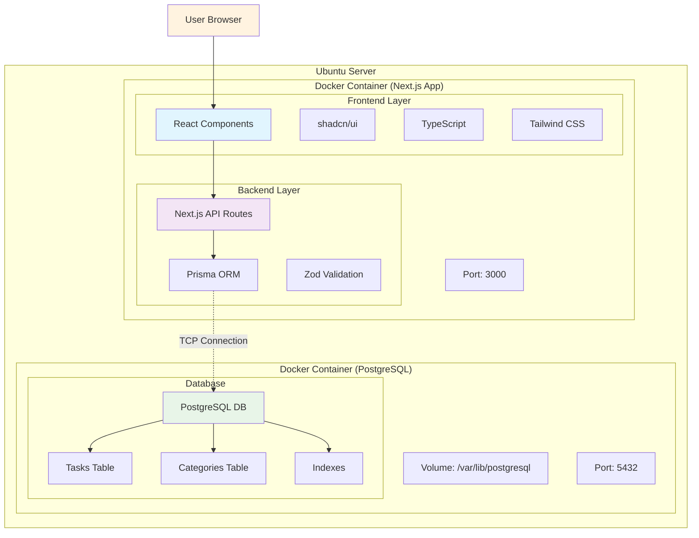
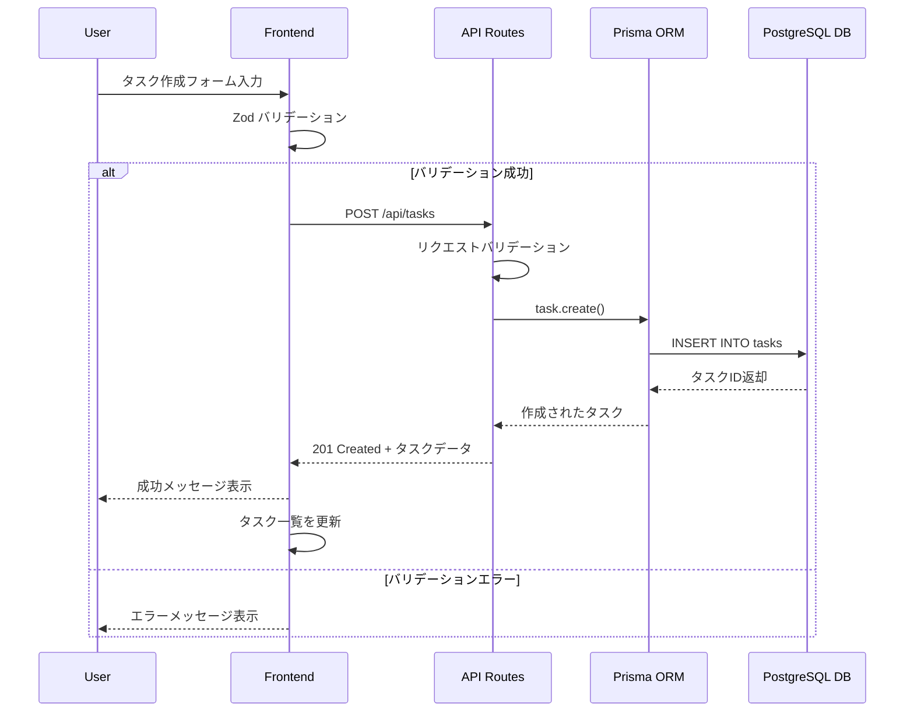
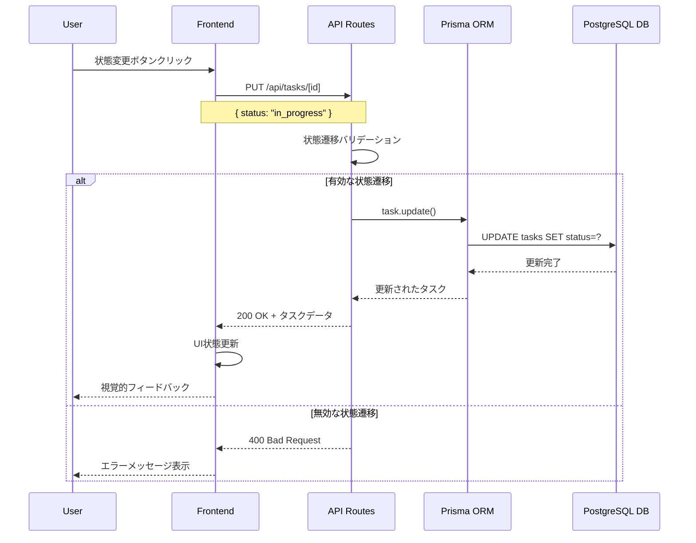
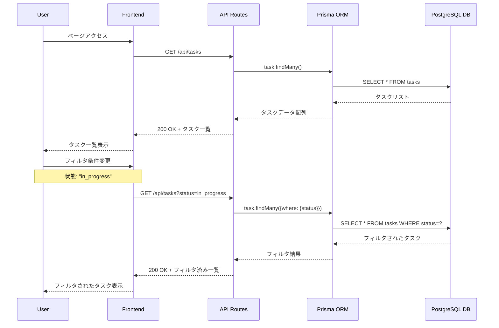
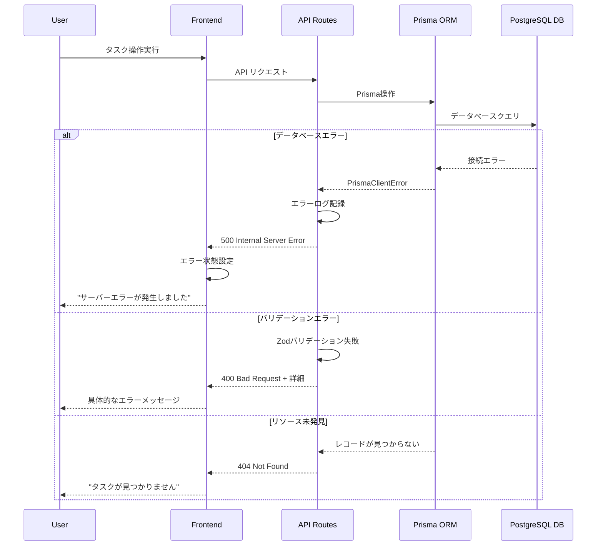

# TODOアプリ アーキテクチャ設計書

## システム全体アーキテクチャ



## シーケンス図

### タスク作成フロー



### タスク状態変更フロー



### タスク一覧取得・フィルタリングフロー



### エラーハンドリングフロー



## フロントエンド アーキテクチャ

### ディレクトリ構造
```
src/
├── app/                    # Next.js App Router
│   ├── globals.css
│   ├── layout.tsx
│   ├── page.tsx
│   ├── tasks/
│   │   ├── page.tsx
│   │   ├── [id]/
│   │   │   └── page.tsx
│   │   └── new/
│   │       └── page.tsx
│   ├── categories/
│   │   ├── page.tsx
│   │   └── [id]/
│   │       └── page.tsx
│   ├── api/
│   │   ├── tasks/
│   │   │   ├── route.ts
│   │   │   └── [id]/
│   │   │       └── route.ts
│   │   └── categories/
│   │       ├── route.ts
│   │       └── [id]/
│   │           └── route.ts
│   ├── _components/           # 再利用可能なコンポーネント
│   │   ├── ui/                # shadcn/ui コンポーネント
│   │   ├── TaskCard.tsx
│   │   ├── TaskForm.tsx
│   │   ├── TaskList.tsx
│   │   ├── CategoryBadge.tsx
│   │   └── SearchBar.tsx
│   ├── _lib/                  # ユーティリティ
│   │   ├── utils.ts
│   │   ├── validations.ts     # Zod schemas
│   │   ├── db.ts             # Prisma client
│   │   └── types.ts          # TypeScript types
├   └── _hooks/                # Custom hooks
│       ├── useTasks.ts
│       ├── useCategories.ts
│       └── useLocalStorage.ts
└── prisma/
    ├── schema.prisma
    ├── migrations/
    └── seed.ts
```

### レイヤー構成

#### 1. プレゼンテーション層 (Components)
- **責務**: UIの表示とユーザーインタラクション
- **技術**: React, shadcn/ui, Tailwind CSS
- **特徴**:
  - Server Components と Client Components の適切な使い分け
  - アクセシビリティの考慮
  - レスポンシブデザイン

#### 2. ビジネスロジック層 (Hooks & Utils)
- **責務**: アプリケーションロジックとデータ変換
- **技術**: Custom Hooks, TypeScript
- **特徴**:
  - 状態管理
  - API呼び出し
  - データバリデーション

#### 3. データアクセス層 (API Routes)
- **責務**: データベースとの通信
- **技術**: Next.js API Routes, Prisma ORM
- **特徴**:
  - RESTful API設計
  - エラーハンドリング
  - レスポンス型定義

## バックエンド アーキテクチャ

### API設計

#### エンドポイント一覧

```typescript
// Tasks API
GET    /api/tasks              # タスク一覧取得
POST   /api/tasks              # タスク作成
GET    /api/tasks/[id]         # 特定タスク取得
PUT    /api/tasks/[id]         # タスク更新
DELETE /api/tasks/[id]         # タスク削除

// Categories API
GET    /api/categories         # カテゴリ一覧取得
POST   /api/categories         # カテゴリ作成
GET    /api/categories/[id]    # 特定カテゴリ取得
PUT    /api/categories/[id]    # カテゴリ更新
DELETE /api/categories/[id]    # カテゴリ削除
```

#### API レスポンス形式

```typescript
// 成功レスポンス
interface ApiResponse<T> {
  success: true;
  data: T;
}

// エラーレスポンス
interface ApiError {
  success: false;
  error: {
    message: string;
    code: string;
    details?: any;
  };
}
```

## セキュリティ設計

### 入力値検証
- **Zod スキーマ**: フロントエンド・バックエンド共通のバリデーション
- **サニタイゼーション**: XSS攻撃の防止
- **型安全性**: TypeScript による静的型チェック

### データベースセキュリティ
- **Prisma ORM**: SQLインジェクション攻撃の防止
- **パラメータ化クエリ**: 安全なデータベースアクセス
- **接続暗号化**: SSL/TLS接続の使用

## パフォーマンス最適化

### フロントエンド最適化
- **Server Components**: サーバーサイドレンダリングの活用
- **動的インポート**: コード分割による初期読み込み時間の短縮
- **画像最適化**: Next.js Image コンポーネントの使用
- **キャッシュ戦略**: SWR または React Query の使用

### バックエンド最適化
- **データベースインデックス**: クエリパフォーマンスの向上
- **接続プール**: データベース接続の効率化
- **レスポンスキャッシュ**: 頻繁にアクセスされるデータのキャッシュ

## 運用・監視

### ロギング
- **アプリケーションログ**: エラーとアクセスログ
- **データベースログ**: クエリパフォーマンスの監視
- **コンテナログ**: Docker コンテナの状態監視

### ヘルスチェック
- **アプリケーション**: `/api/health` エンドポイント
- **データベース**: 接続確認とレスポンス時間測定
- **コンテナ**: Docker Compose health check

### バージョン管理, 設定ファイルの管理方法
- **アプリケーションコード**: Git リポジトリでの管理
- **設定ファイル**: 環境変数とDockerfile の管理
